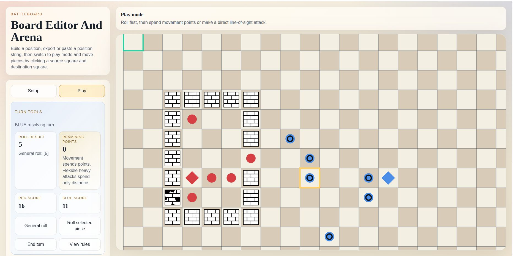

# Battleboard

Battleboard is a web-based 2D strategy prototype built with TypeScript, Vite, and PixiJS. It combines a large configurable board editor with a turn-based tactics sandbox where red and blue teams fight using dice-driven movement and attack rules.

## Screenshot



## Features

- Configurable square board with large-map support.
- Setup mode for placing red, blue, and neutral wall pieces directly on the board.
- Position-string format for saving and loading board states.
- Play mode with click-based selection, movement, attacks, captures, scoring, and win detection.
- Rules modal for quick in-app reference.
- Neutral wall pieces with two-hit durability and cracked visual state.

## Piece Types

- `Soldier`: melee attacker, circular token, direct capture.
- `Archer`: ranged attacker, circular token with ring marker.
- `Champion`: flexible attacker, triangle token, moves onto captured square.
- `Leader`: diamond token, cannot attack directly; losing it ends the game.
- `Behemoth`: heavy ranged attacker, triangle token with black center.
- `Wall`: neutral blocker that takes two direct hits to destroy.

## Rules Summary

- Red and blue alternate turns.
- Each turn allows exactly one roll.
- General roll: `1d6`, usable across movement by multiple friendly pieces or one soldier/archer attack.
- Piece roll: `1d6`, usable only by the selected piece.
- Soldiers and archers attack using the full roll distance in straight unobstructed line of sight.
- Champions and behemoths can spend their points across movement and multiple direct line-of-sight attacks.
- Champions capture by moving onto the target square.
- Behemoths and archers capture from range and stay put.
- Leaders cannot attack directly.
- Walls crack on the first direct hit and are removed on the second.

## Scoring

- Soldier: `1`
- Archer: `2`
- Champion: `8`
- Behemoth: `20`
- Leader: `50`

## Position String

Battleboard uses a compact FEN-like format:

`bb1;size=20;turn=red;rows=...`

- Rows are separated by `/`.
- Digits compress consecutive empty squares.
- Lowercase letters are red pieces.
- Uppercase letters are blue pieces.
- `x` is an intact wall.
- `X` is a cracked wall.

## Development

Install dependencies and run the Vite dev server:

```bash
npm install
npm run dev
```

Create a production build:

```bash
npm run build
```

Preview the production build locally:

```bash
npm run preview
```

## Tech Stack

- TypeScript
- Vite
- PixiJS
